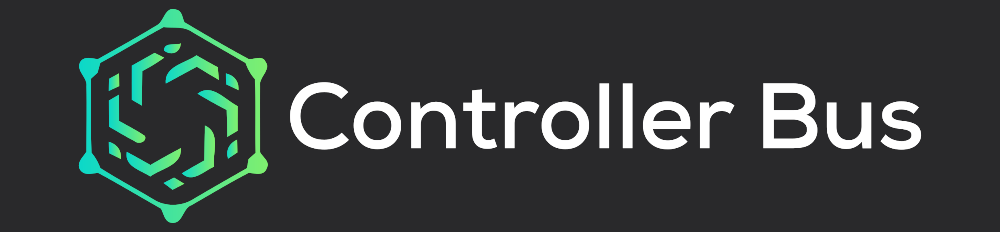

## Introduction

ControllerBus is a framework for Go applications using modular components which
communicate over a shared bus with "Directives" to other controllers. Directives
can be de-duplicated to share a single instance (& result) of a task.

The controller implementations operate concurrently and synchronize with each
other only when necessary. This results in extremely fast and lightweight
programs which operate with maximum possible parallelism (with Goroutines).

Config objects are Protobuf messages with attached validation functions and
controller IDs. Config objects can be passed to the loader controller, which
resolves and starts the corresponding Controller.  

When attaching to the bus, all ongoing Directives are passed to the Controller,
Controllers can return Resolver objects to concurrently fetch results in a
separate Goroutine. Decoupling the implementations of the components from the
APIs and configurations makes it easy to hot-load new implementations without
even restarting the program.

Controllers can be attached and detached on-demand. There is an associated
example daemon and GRPC API for remotely starting Controllers over a network and
issuing directives from a command-line interface.

The Plugin system implements hot-loading and dynamic linking of components.

### Similar to Microservices

The controller model is similar to the microservices model:

 - Declare a contract for a component as an API (Rest, gRPC)
 - Other components link against the client for that API
 - Communication between components occurs in-process over network.
 - Subroutines concurrently process requests (distributed model).

The goal of this project is to find a happy medium between the two approaches,
supporting statically linked, dynamically linked (plugin), or networked
(distributed) controller implementations and execution models. In practice, it
declares a common format for controller configuration, construction, and
execution in Go projects.

## Examples

[](https://asciinema.org/a/418275)

The [boilerplate](./example/boilerplate/controller/config.proto) example has the
following configuration proto:

```protobuf
// Config is the boilerplate configuration.
message Config {
  // ExampleField is an example configuration field.
  string example_field = 1;
}
```

This is an example YAML configuration for this controller:

```yaml
exampleField: "Hello world!"
```

Using the **LoadControllerWithConfig** directive, we can instruct the system to
resolve the configuration type to a controller factory & exec the controller:

```go
	bus.ExecOneOff(
		ctx,
		cb,
		resolver.NewLoadControllerWithConfig(&boilerplate_controller.Config{
			ExampleField: "Hello World!",
		}),
		nil,
	)
```

You can also run this demo by:

```sh
cd ./cmd/controllerbus
go build -v 
./controllerbus daemon
```

This will load `controllerbus_daemon.yaml` and execute the boilerplate demo:

```
added directive                               directive="LoadControllerWithConfig<config-id=controllerbus/configset/1>"
added directive                               directive="ExecController<config-id=controllerbus/configset/1>"
added directive                               directive="LoadConfigConstructorByID<config-id=controllerbus/example/boilerplate/1>"
starting controller                           controller=controllerbus/configset/1
added directive                               directive="ApplyConfigSet<controller-keys=boilerplate-example-0@1>"
added directive                               directive="LoadControllerWithConfig<config-id=controllerbus/bus/api/1>"
removed directive                             directive="LoadConfigConstructorByID<config-id=controllerbus/example/boilerplate/1>"
added directive                               directive="ExecController<config-id=controllerbus/bus/api/1>"
executing controller                          config-key=boilerplate-example-0 controller=controllerbus/configset/1
starting controller                           controller=controllerbus/bus/api/1
grpc api listening on: :5110                 
added directive                               directive="LoadControllerWithConfig<config-id=controllerbus/example/boilerplate/1>"
added directive                               directive="ExecController<config-id=controllerbus/example/boilerplate/1>"
starting controller                           controller=controllerbus/example/boilerplate/1
hello from boilerplate controller 1: hello world  controller=controllerbus/example/boilerplate/1
controller exited normally                    controller=controllerbus/example/boilerplate/1 exec-time="31.053µs"
```

### ConfigSet

**ConfigSet** is a key/value set of controller configurations to load.

The following is an example ConfigSet in YAML format for a program:

```yaml
example-1:
  # configuration object
  config:
    exampleField: "Hello world 1!"
  # ID of the configuration type
  id: controllerbus/example/boilerplate/1
  # revision # for overriding previous configs
  revision: 1
```

In this case, `example-1` is the ID of the controller. If multiple ConfigSet are
applied with the same ID, the latest revision wins. The ConfigSet controller
will automatically start and stop controllers as ConfigSets are changed.

## Daemon and API

The [example daemon](./cmd/controllerbus) is an associated client and CLI for
the [Bus GRPC API](./bus/api), for example:

```sh
$ controllerbus client exec -f controllerbus_daemon.yaml 
```

```json
  {
    "controllerInfo": {
      "version": "0.0.1",
      "id": "controllerbus/example/boilerplate/1"
    },
    "status": "ControllerStatus_RUNNING",
    "id": "boilerplate-example-0"
  }
```

The bus service has the following API:

```protobuf
// ControllerBusService is a generic controller bus lookup api.
service ControllerBusService {
  // GetBusInfo requests information about the controller bus.
  rpc GetBusInfo(GetBusInfoRequest) returns (GetBusInfoResponse) {}
  // ExecController executes a controller configuration on the bus.
  rpc ExecController(controller.exec.ExecControllerRequest) returns (stream controller.exec.ExecControllerResponse) {}
}
```

The GRPC API is itself implemented as a controller, which can be configured:

```yaml
grpc-api:
  config:
    listenAddr: ":5000"
    busApiConfig:
      enableExecController: true
  id: controllerbus/bus/api/1
  revision: 1
```

For security, the default value of `enableExecController` is `false` to disallow
executing controllers via the API.

The structure under `cmd/controllerbus` and `example/boilerplate` are examples
which are intended to be copied to other projects, which reference the core
`controllerbus` controllers. A minimal program is as follows:

```go
	ctx := context.Background()
	log := logrus.New()
	log.SetLevel(logrus.DebugLevel)
	le := logrus.NewEntry(log)

	b, sr, err := core.NewCoreBus(ctx, le)
	if err != nil {
		t.Fatal(err.Error())
	}
	sr.AddFactory(NewFactory(b))

	execDir := resolver.NewLoadControllerWithConfig(&Config{
		ExampleField: "testing",
	})
	_, ctrlRef, err := bus.ExecOneOff(ctx, b, execDir, nil)
	if err != nil {
		t.Fatal(err.Error())
	}
	defer ctrlRef.Release()
```

This provides logging, context cancelation. A single Factory is attached which
provides support for the Config type, (see the boilerplate example).

## Plugins

The [plugin](./plugin) system and compiler scans a set of Go packages for
ControllerBus factories and bundles them together into a hashed Plugin bundle.
The compiler CLI can watch code files for changes and re-build automatically.
Multiple plugin loaders and binary formats are supported.

```
USAGE:
   controllerbus hot compile - compile packages specified as arguments once

OPTIONS:
   --build-prefix value           prefix to prepend to import paths, generated on default [$CONTROLLER_BUS_PLUGIN_BUILD_PREFIX]
   --codegen-dir value            path to directory to create/use for codegen, if empty uses tmpdir [$CONTROLLER_BUS_CODEGEN_DIR]
   --output PATH, -o PATH         write the output plugin to PATH - accepts {buildHash} [$CONTROLLER_BUS_OUTPUT]
   --plugin-binary-id value       binary id for the output plugin [$CONTROLLER_BUS_PLUGIN_BINARY_ID]
   --plugin-binary-version value  binary version for the output plugin, accepts {buildHash} [$CONTROLLER_BUS_PLUGIN_BINARY_VERSION]
   --no-cleanup                   disable cleaning up the codegen dirs [$CONTROLLER_BUS_NO_CLEANUP]
   --help, -h                     show help
```

The CLI will analyze a list of Go package paths, discover all Factories
available in the packages, generate a Go module for importing all of the
factories into a single Plugin, and compile that package to a .so library.

## Daemon and Client CLIs

Plugins can be bundled together with a set of root configurations into a CLI.
This can be used to bundle modules into a daemon and/or client for an
application - similar to the [controllerbus cli](./cmd/controllerbus).

## Testing

An in-memory Bus can be created for testing, an
[example](./example/boilerplate/controller/controller_test.go) is provided in
the boilerplate package.

## Support

ControllerBus is built & supported by Aperture Robotics, LLC.

Please open a [GitHub issue] with any questions / issues.

[GitHub issue]: https://github.com/aperturerobotics/controllerbus/issues/new

... or feel free to reach out on [Matrix Chat] or [Discord].

[Discord]: https://discord.gg/EmeEENhKkg
[Matrix Chat]: https://matrix.to/#/#aperture-robotics:matrix.org
